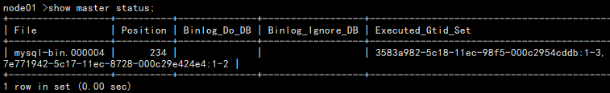

mysql mha failover scripts!

**node**

```sh
[root@master ~]# tar zxf /server/soft/mha4mysql-node-0.58.tar.gz -C /opt/
[root@master ~]# yum install perl-CPAN perl-DBD-MySQL perl-Config-Tiny perl-Email-Date-Format perl-Log-Dispatch perl-Mail-Sender  perl-Mail-Sendmail perl-MIME-Lite perl-MIME-Types perl-Parallel-ForkManager perl-Params-Validate perl-Time-HiRes -y

[root@node01 ~]# cd mha4mysql-node-0.58/
[root@node01 ~/mha4mysql-node-0.58]# perl Makefile.PL 
[root@node01 ~/mha4mysql-node-0.58]# make ;make install
```

**manager**

```sh
root@node02 ~]# tar zxf /server/soft/mha4mysql-manager-0.58.tar.gz 
[root@node02 ~]# cd mha4mysql-manager-0.58/
[root@node02 ~/mha4mysql-manager-0.58]# perl Makefile.PL 
[root@node02 ~/mha4mysql-manager-0.58]# make;make install
```

配置文件

```sh
vi /etc/mha/app1/app1.cnf 中启用下面三个参数：
master_ip_failover_script= /usr/local/bin/master_ip_failover   #master failover时执行
report_script=/usr/local/bin/send_report     #master failover时执行发邮件设置
master_ip_online_change_script=/usr/local/bin/master_ip_online_change   #master switchover时执行
#shutdown_script= /etc/masterha/power_manager
```





